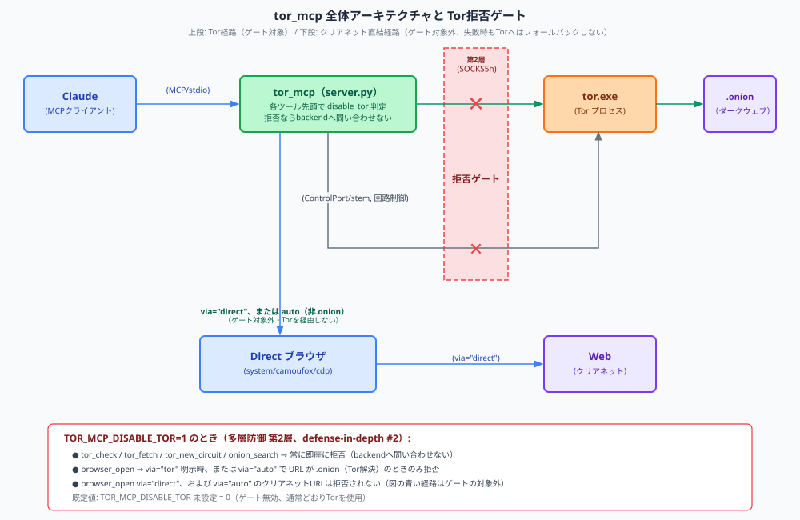
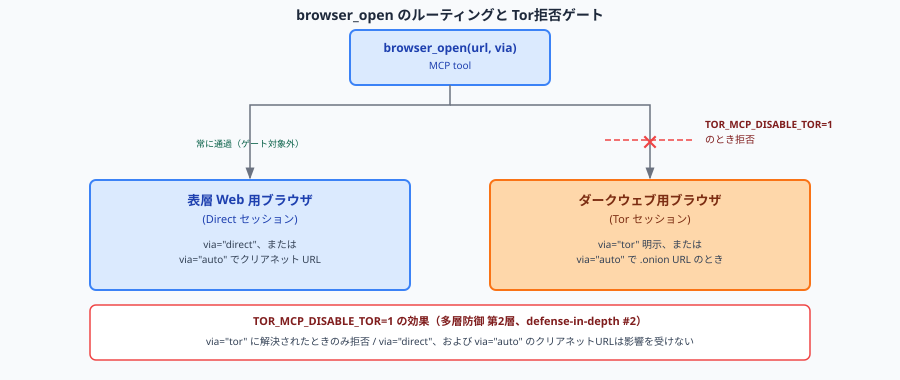

# tor_mcp — Tor接続 MCPサーバ（ダークウェブOSINT支援）

ローカルで管理する Tor プロセス（SOCKS5h プロキシ）経由で .onion / Web に
アクセスする MCP サーバ。**受動的な OSINT 情報収集**を目的とする。



`TOR_MCP_DISABLE_TOR=1` を設定すると、上図の赤いゲート地点で `tor_mcp`
自体がバックエンド（Tor プロセス）へ到達する前にツール呼び出しを拒否する
（詳細は [Tor拒否ゲート](#tor拒否ゲートtor_mcp_disable_tor) を参照）。

## 提供ツール

### Tor ネットワーク

| ツール | 用途 |
|--------|------|
| `tor_check` | Tor 経由かを検証し、出口ノードIPを返す（初回は tor 起動で10〜40秒） |
| `tor_fetch` | .onion / Web ページを取得（HTML→テキスト整形・タイトル・リンク抽出） |
| `tor_new_circuit` | 新しい回路（別の出口IP）を要求。前後の出口IPと変化有無を返す |
| `onion_search` | Tor 検索エンジン（Tordex / Torch）で .onion を検索 |

### ブラウザ（Playwright + Camoufox）

JavaScript レンダリングが必要なページ・ログインが必要なサイト・キュー待ちが
発生する掲示板など、`tor_fetch` では取れないコンテンツ向け。

| ツール | 用途 |
|--------|------|
| `browser_open` | URL を開く（ルーティング自動）。`via` パラメータで強制指定可 |
| `browser_state` | 現在のページ状態を再取得（ポーリング用） |
| `browser_click` | CSS セレクタで要素をクリック |
| `browser_fill` | 入力フィールドに値を入力 |
| `browser_wait` | セレクタ出現 / URL 変化 / テキスト出現を待機 |
| `browser_screenshot` | PNG スクリーンショットを保存 |
| `browser_eval` | JavaScript を実行して結果を取得 |
| `browser_login` | 環境変数から認証情報を読んでログインフォームを送信 |
| `browser_close` | セッションを閉じる（プロフィール保持） |
| `browser_reset` | セッションを閉じてプロフィールも削除 |

#### ブラウザのルーティング設計



`via="tor"` に解決される経路（`via="tor"` 明示、または `via="auto"` で
`.onion` URL）は `TOR_MCP_DISABLE_TOR=1` のとき拒否される。`via="direct"`
はこのゲートの影響を受けない。

**2つのブラウザセッションを使い分ける理由:**

- Camoufox (Firefox) はプロキシをブラウザ起動時に設定する。同一プロセス内で
  Tor ↔ Direct を切り替えることはできない。
- 表層 Web とダークウェブはそもそも別の調査対象であり、Cookie や
  セッション状態を混在させないほうが調査の汚染が防げる。
- ウィンドウが2つ開く場合があるが、これは設計上の意図。

**`browser_open` の `via` パラメータ:**

| 値 | 動作 |
|----|------|
| `"auto"` (既定) | .onion → Tor 固定。クリアネット → Direct。ウィンドウが閉じていれば自動再起動。失敗時はそのままエラーになる（Torへのフォールバックはしない） |
| `"tor"` | 常に Tor 経由（クリアネットでも匿名性が必要なとき） |
| `"direct"` | 常に Direct（.onion は拒否）。ウィンドウが閉じていれば自動再起動 |

結果の `via` フィールドで実際に使われたルートを確認できる（`"direct"` / `"tor"`）。

#### 手動テスト（browse_cli.py）

```bash
# OSINT ルートから起動
uv run browse_cli.py
```

```
URL (Enter to quit): https://check.torproject.org/
Mode [a/t/d] (a): t
  → via=tor  status=200  title='Tor Project | Are you using Tor?'
```

モード指定: `a` = auto、`t` = tor 強制、`d` = direct 強制

## セットアップ

### 1. 依存パッケージ

```bash
# Playwright のバンドルブラウザはダウンロードしない（システムブラウザ + Camoufox を使うため）
export PLAYWRIGHT_SKIP_BROWSER_DOWNLOAD=1   # Windows(PowerShell): $env:PLAYWRIGHT_SKIP_BROWSER_DOWNLOAD=1
uv pip install -r tor_mcp/requirements.txt

# Camoufox（アンチフィンガープリント Firefox）本体を取得
uv run python -m camoufox fetch
```

（`mcp`, `httpx[socks]`, `stem`, `beautifulsoup4`, `playwright`, `camoufox`）

> **ブラウザ方針**: 本サーバは Tor 接続に Camoufox、Direct 接続にシステムインストール済み
> ブラウザ（または Camoufox）を使う。`playwright install` は**実行不要**で、Playwright の
> バンドルブラウザ（chromium/firefox/webkit）は一切起動しない。詳細は [docs/BROWSERS.md](docs/BROWSERS.md)。

### 2. Tor 本体（Tor Expert Bundle）の配置

リポジトリにはバイナリを含めない。各自で配置する（[vendor/README.md](vendor/README.md) 参照）。

- 取得: https://www.torproject.org/download/tor/ → **Windows Expert Bundle**
- 配置: 展開した `tor` フォルダの中身を `tor_mcp/vendor/tor/` へ
  （`tor_mcp/vendor/tor/tor.exe` になるように）
- 確認: `uv run python -m tor_mcp.tor_process --check-binary`

`tor.exe` のパスは環境変数 `TOR_MCP_TOR_EXE` で上書き可能。

### 3. MCP サーバとして登録

プロジェクトルートの [.mcp.json](../.mcp.json) で `tor-osint` サーバが定義済み。
Claude Code をこのディレクトリで起動すると認識される。

## 設定（環境変数）

| 変数 | 既定 | 説明 |
|------|------|------|
| `TOR_MCP_TOR_EXE` | `vendor/tor/tor.exe` | tor バイナリのパス |
| `TOR_MCP_SOCKS_PORT` | `9050` | SOCKS5 ポート（Tor Browser 併用時は競合に注意） |
| `TOR_MCP_CONTROL_PORT` | `9051` | ControlPort（回路制御用） |
| `TOR_MCP_DIRECT_BROWSER` | `(auto)` | Direct 接続のエンジン: `cdp` / `system` / `camoufox` / 空=自動（system→camoufox） |
| `TOR_MCP_CLEARNET_BROWSER_EXE` | `(auto)` | system エンジン時に使うブラウザ実行ファイルの絶対パス |
| `TOR_MCP_CLEARNET_BROWSER_TYPE` | `(auto)` | `chromium` / `firefox`（system エンジンのブラウザ種別） |
| `TOR_MCP_CDP_PORT` | `9222` | cdp エンジンのリモートデバッグポート |
| `TOR_MCP_CDP_AUTOLAUNCH` | `1` | cdp: ポート未起動時に Chrome を自動起動 |
| `TOR_MCP_CHROME_EXE` | `(auto)` | cdp: Chrome 実行ファイル（空=自動検出） |
| `TOR_MCP_CHROME_USER_DATA_DIR` | `vendor/cdp-chrome-profile` | cdp: User Data ディレクトリ（実プロファイル使用時は実 User Data を指定） |
| `TOR_MCP_CHROME_PROFILE_DIR` | `Default` | cdp: `--profile-directory`（`Profile 1` 等） |
| `PLAYWRIGHT_SKIP_BROWSER_DOWNLOAD` | `1`（推奨） | Playwright バンドルブラウザのダウンロード抑止（本サーバは使用しない） |
| `TOR_MCP_DISABLE_TOR` | `0`（無効） | `1`/`true`/`yes`/`on` で Tor 経路を拒否するゲートを有効化（後述） |

接続モデルとブラウザ選択の詳細は [docs/BROWSERS.md](docs/BROWSERS.md) を参照。

Tor のライフサイクルはサーバが管理する（初回ツール使用時に起動、終了時に停止）。

### Tor拒否ゲート（`TOR_MCP_DISABLE_TOR`）

クリアネット専用の調査（例: `osint-agent.py --scope clearnet`）でも、
上流のフィルタが `.onion` URL を誤って通過させてしまう可能性がある。
`TOR_MCP_DISABLE_TOR=1` は、そうした場合に備えた**多層防御の第2層**として
`tor_mcp` サーバ自体に組み込まれた実行時ゲートで、バックエンド（Tor プロセス）
へ一切到達させずにツール呼び出しを拒否する。

- `tor_check` / `tor_fetch` / `tor_new_circuit` / `onion_search` は
  関数の先頭で無条件に拒否する。
- `browser_open` は解決された接続方式が `"tor"` のとき
  （`via="tor"` 明示、または `via="auto"` かつ URL が `.onion`）だけ拒否する。
  `via="direct"`、および `via="auto"` でクリアネット URL のときは拒否されない
  （`via="auto"` は Direct 接続に失敗しても Tor へフォールバックしないため、
  この静的な判定だけで十分である）。
- 既定値は無効（`0`）。設定しない限り、これまでどおり Tor 経由の調査を行える。

拒否時は `{"error": "tor_disabled", ...}` を返し、Tor 側へのアクセス試行は
一切発生しない（ログにも残らない）。設計の経緯は
[plans/osint-agent-scope-and-followup-design.md](../plans/osint-agent-scope-and-followup-design.md)
の決定事項8を参照。

## 動作確認（スタンドアロン）

```bash
# tor バイナリ検出
uv run python -m tor_mcp.tor_process --check-binary
# tor 起動 → bootstrap → 停止
uv run python -m tor_mcp.tor_process --start
# 全ツールのスモークテスト（tor 経由通信あり、数十秒）
PYTHONUTF8=1 uv run python -m tor_mcp.scratch
```

## 運用ノウハウ / トラブルシューティング

### 目視確認は `manual_check.py`（既存Torに相乗り）
MCPサーバ稼働中に手動で取得結果を目で見たいときは `manual_check.py` を使う。
このスクリプトは**新しい tor.exe を起動せず、MCPが既に動かしている SOCKS
9050 に相乗り**するため、ポート衝突しない。

```bash
# 既定の2URL(check.torproject + DuckDuckGo onion)を順に取得・表示
PYTHONUTF8=1 uv run python -m tor_mcp.manual_check
# 任意URLを目視確認（複数可）。status / final_url / content-type / title / 本文先頭500字
PYTHONUTF8=1 uv run python -m tor_mcp.manual_check https://example.onion/
```

逆に `tor_process --start` や `scratch` は**自前で tor.exe を起動する**ので、
MCPサーバが既にTorを動かしていると 9050/9051 で衝突する。手動の目視確認には
`manual_check.py` を使い分けること。

### `Address already in use [WSAEADDRINUSE]`（起動失敗）
9050/9051 を別の tor.exe が掴んでいる。多くは前回実行で残った孤立プロセス。

```bash
netstat -ano | grep -E "9050|9051"          # 占有PIDを特定
taskkill //PID <該当PID> //F                # vendor/tor 配下のものだけ落とす
```

- **Tor Browser は 9150/9151** を使うため本サーバ（9050/9051）と共存可。
  Tor Browser の tor.exe は落とさないこと。素性は
  `powershell -NoProfile -Command "Get-CimInstance Win32_Process -Filter \"name='tor.exe'\" | Select ProcessId,CommandLine | Format-List"`
  で CommandLine を見て判別する（`tor_mcp/vendor/tor` 配下が本サーバのもの）。

### 文字化け（cp932）
日本語コンソールで実行する際は `PYTHONUTF8=1` を付ける。無いと cp932 で
クラッシュ・文字化けすることがある。

## 倫理・法的方針（重要）

- **受動的な情報収集（閲覧・公開テキストの収集）に限定**する。
- 不正アクセス、違法コンテンツの取得・取引、能動的攻撃には使用しない。
- `onion_search` の結果には未審査・違法な掲載が含まれ得る。
  **結果は検証者が評価する前提**であり、ツールは内容の合法性を保証しない。
- 調査は認可された範囲で、各国法令・所属組織の規程に従って実施すること。

## ライセンス / 著作権

Copyright (c) 2026 segfo

本ソフトウェアは MIT License の下で公開されています。詳細は [LICENSE](LICENSE) を参照。
